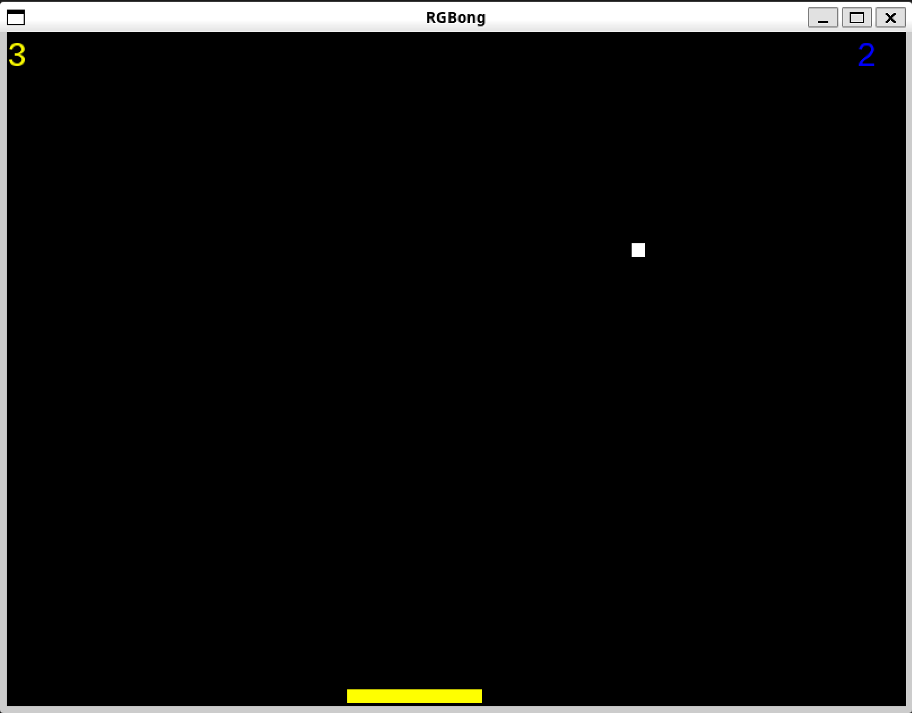

# RGBong

## Description
A small pong-based game written in C++17 and SFML 2.

## Gameplay
The game is played by two players controlling a single paddle which changes color depending on which player controls the paddle. The first player controls the yellow paddle with the A, D keys and the second controls the blue paddle with the left and right arrow keys. The task for the players is to keep the ball from passing the bottom border of the window during their turns using the paddle. The paddle colors were chosen specifically to be distinguishable for colorblind people.


## Usage
### Prerequisites
- CMake 3.10.0 or newer
- A C++ compiler supporting C++17
- SFML 2.6.1

### Building
Building is done with CMake. The app needs to be executed with a `font.ttf` file containing a font in the execution directory.

On Linux open the terminal and execute the following in the project root directory:
```sh
cmake -S . -B build     # Configuring and generating the project files
cd build                # Entering the newly created build directory
make                    # Compiling the project
./rgbong                # Running the game
```

The procedure should be similar on Windows and MacOS.

### Controls
The game is played using the A, D keys for player 1 (yellow) and Left, Right arrow keys for player 2 (blue).
- A - Move paddle left (Player 1)
- D - Move paddle right (Player 1)
- Left arrow key - Move paddle left (Player 2)
- Right arrow key - Move paddle right (Player 2)
- Space - Start/pause the game